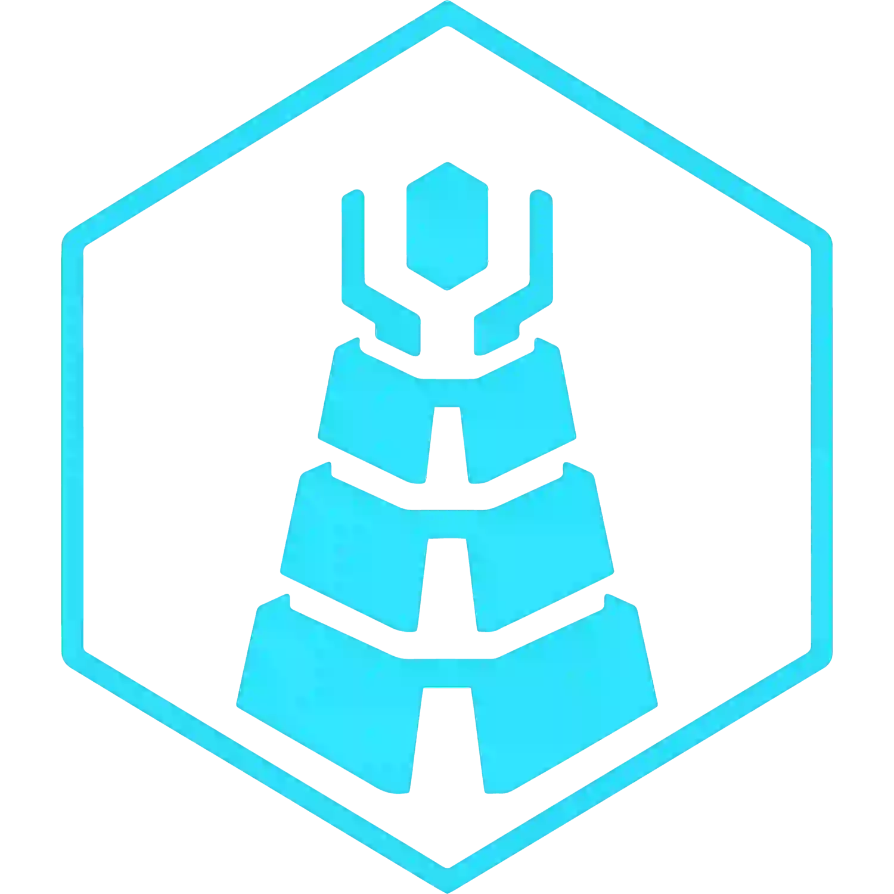
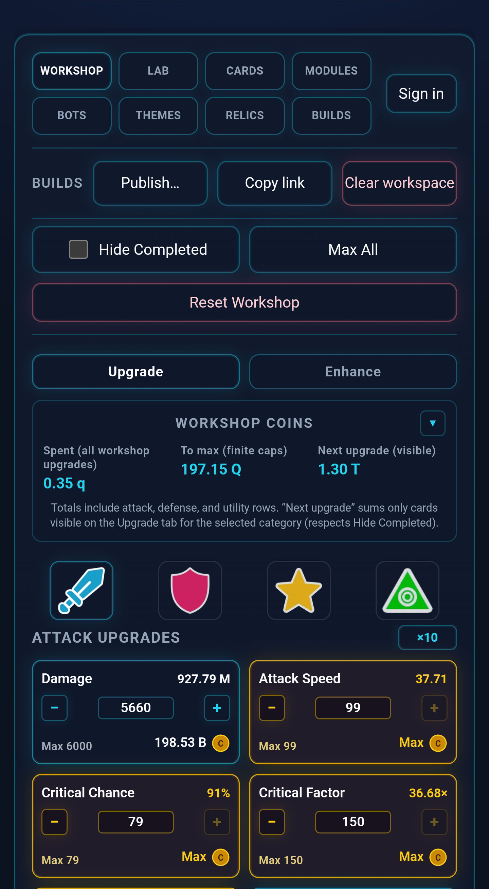
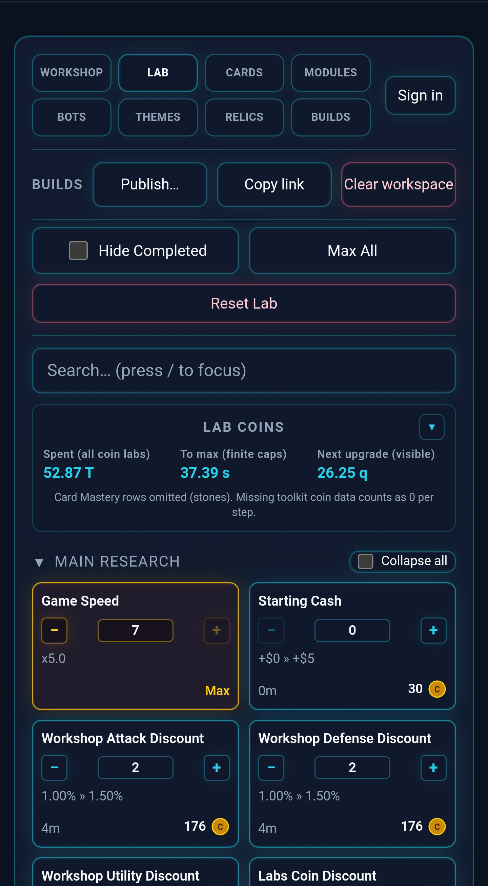
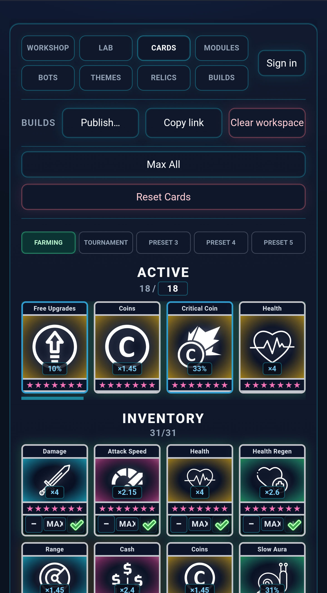
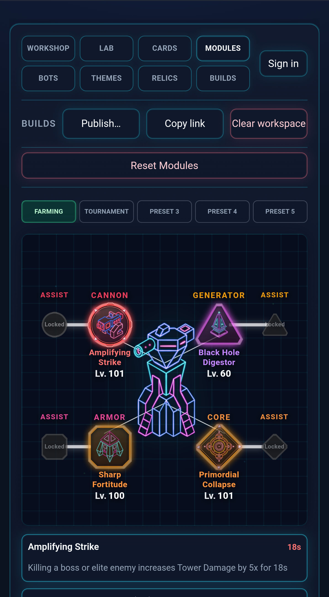
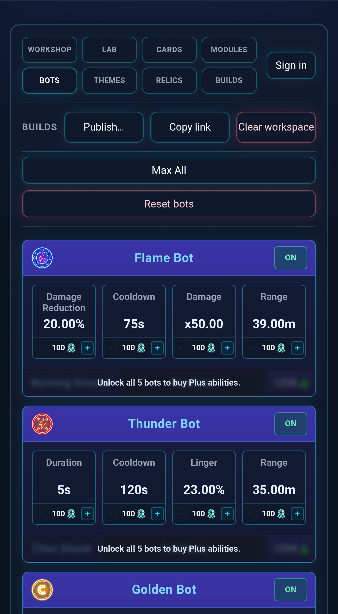
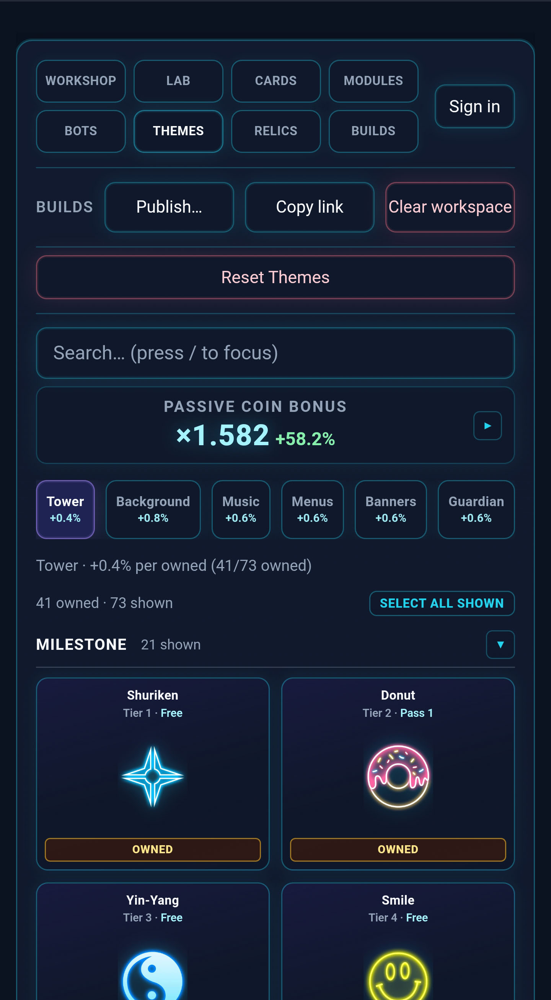
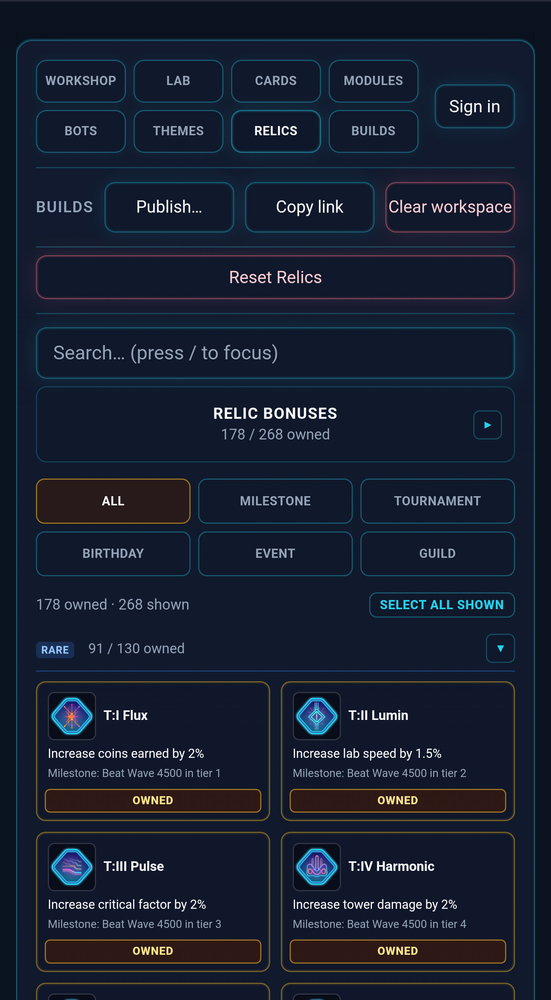
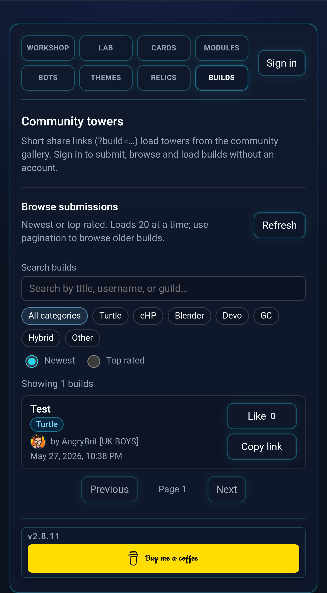

# TowerSmith — Forge your perfect build



> A browser-based companion for [**The Tower**](https://www.techtreegames.com/) — plan labs, model upgrades, import your save, compare builds, and share loadouts without touching the game.

**[▶ Open TowerSmith](https://www.towersmith.com/)**

**Get The Tower:** [Google Play](https://play.google.com/store/apps/details?id=com.TechTreeGames.TheTower&hl=en_GB) · [App Store](https://apps.apple.com/gb/app/the-tower-idle-tower-defense/id1575590830) · [TechTree Store](https://store.techtreegames.com/thetower/)


[](https://app.netlify.com/projects/towerlabs/deploys)

---

## Screenshots

<p float="left">
  
  
  
  
  
  
  
  
</p>

---

## What TowerSmith does

| Area | What you can do |
|------|----------------|
| **Research** | Browse every research tree (main, attack, defense, utility, cards, perks, bots, modules, and more) with costs and benefits shown where wiki data allows. |
| **Labs** | Model upgrade costs and build times, compare configs side by side, save named presets, and use **Max All** to cap every visible lab at once. |
| **Workshop** | Simulate attack, defense, utility, and ultimate-weapon upgrades with full coin and power-stone costs. Buy-multiplier rail includes **MAX** (+ to cap, − to zero). The **Enhance** tab unlocks once Workshop Enhancements is researched. |
| **Bots** | Track the five event-shop bots (Flame, Thunder, Golden, Amplify, Bot Bot), medal unlock order, stat upgrades, and Bot+ abilities. BOTS lab levels update cooldown and duration live. |
| **Cards** | Manage your full 31-card inventory, star levels (Lv.1–7), five preset loadouts, equip-slot limits, and Card Mastery scaling. |
| **Modules** | Configure chassis modules (cannon / armor / core / generator) across epic→ancestral tiers, sub-module effects, assist unlocks, stone efficiency, and five saved module presets. |
| **Relics** | Catalog all 268 wiki relics with art, filter by unlock group, and have owned relics feed automatically into workshop stat formulas. |
| **Themes** | Track owned tower skins, backgrounds, banners, music, and guardians — including coin-bonus rollups per category. |
| **Displayed stats** | Workshop cards show wiki-aligned damage and attack speed folding in labs, enhancements, Card Mastery, relics, perks, and equipped sub-modules. |

---

## Getting your data in

**Import your save** — On the LAB tab, load a gzip-compressed **playerInfo.dat** from The Tower (account menu → tower backup). TowerSmith maps your lab levels, workshop stats, bots, ultimates, modules, card stars, relics, and owned themes in one shot.

- **Android:** tap **Import playerInfo.dat** to copy the save-folder path, then pick the file.
- **iOS:** import a copy from Files, iCloud, or a backup extract (the game sandbox isn't browsable in-browser).

**CSV backup** — Export/import a `tower_csv_v1` file with one or more named builds (labs, workshop, cards, module presets) plus your owned theme IDs. Swap builds without overwriting your current setup.

---

## Sharing builds

**Share links** encode a full snapshot (labs, workshop, build name, themes) in the `?tower=` query string. Copy the URL or generate a QR code — anyone opening the link gets the same build.

**Community gallery** — Browse and load community builds from the **BUILDS** tab. Sign in with Google or Discord (footer) to publish your own. **Copy share link** publishes and copies a short `?build=<uuid>` URL in one step.

---

## App experience

- **Appearance** — Dark (default), Light, and High contrast themes in Tools / Settings.
- **Keyboard shortcuts** — `/` focuses search on Labs, Relics, and Themes; `1`–`8` switches main tabs; `Ctrl+Z` undoes the last Max All or reset (up to 20 steps); `Esc` closes the top dialog. Full list under Tools / Settings → **Keyboard shortcuts**.
- **Deep links** — Link directly to a lab card, workshop stat, ultimate weapon, or relic via URL hash or query param.
- **PWA** — Install to your home screen (Tools / Settings → **Install app** on Android; Safari Share → Add to Home Screen on iOS). Works with limited offline support.
- **Persistence** — All settings, snapshots, presets, and owned IDs survive reloads. Full reset available in Tools / Settings.

For release history, see [`CHANGELOG.md`](CHANGELOG.md).

---

## Getting started (local dev)

**Requirements:** Node.js 20 or newer (CI uses Node 22).

```bash
npm install
npm run dev
```

Open the URL Vite prints (default `http://localhost:5173/`). The dev server also advertises a **Network** URL for testing on a phone on the same Wi-Fi.

**Production build**

```bash
npm run build   # typecheck + bundle → dist/
npm run preview # serve dist/ locally
```

**With the community gallery**

```bash
npm run dev:netlify
```

Requires Supabase env vars — copy `.env.example` to `.env` and fill in your keys. See [Community gallery](#community-gallery-netlify--supabase).

---

## npm scripts

| Command | Description |
|---------|-------------|
| `npm run dev` | Start the Vite dev server with HMR. |
| `npm run dev:netlify` | Vite + Netlify Functions locally (needed for the community gallery). |
| `npm run build` | Typecheck and bundle to `dist/`. |
| `npm run preview` | Serve the production build locally. |
| `npm run lint` | Run ESLint. |
| `npm run test` | Run Vitest unit tests. |
| `npm run test:e2e` | Playwright end-to-end tests (share-link flow). |
| `npm run check:i18n` | Fail if locale dictionaries drift from English keys. |
| `npm run wiki-stamp` | Bump the wiki/game alignment date shown in Tools / Settings. |
| `npm run icons` | Re-rasterize `public/app-icon.svg` → favicon and PWA PNGs. |
| `npm run og-banner` | Regenerate the 1200×630 social preview image. |

---

## Project layout (key paths)

| Path | Role |
|------|------|
| `public/research/` | Runtime research data: `manifest.json` and section JSON files. |
| `tables/` | Screenshot-derived **GOD** lab/workshop tables (authoritative cost/value ground truth). Consumed via [`src/data/labGodTables.ts`](src/data/labGodTables.ts); audit with `node scripts/audit-lab-god-sources.mjs`. |
| `src/data/` | Lab costs (`tower-labs.json`), workshop curves, bot/ultimate/relic/module tables, and generated data files. Coin formatting rules: [`src/labCosts.ts`](src/labCosts.ts) (see [Lab coin display](#lab-coin-display)). |
| `src/playerSave/` | playerInfo.dat NRBF decoder, save-field mappings, and import pipeline. `researchLevel[]` slots map to lab names via `game*ResearchMapping.ts` (regenerate index: `node scripts/gen-game-research-index.mjs`). Modern saves use per-bot `*BotPresets` (`levels[]` = `[cooldown, range, weaponStat2, weaponStat4]`); older saves use `bots*Presets` BinaryArrays ([`gameBotLegacyPresetMapping.ts`](src/playerSave/gameBotLegacyPresetMapping.ts)). Module chassis: `infoIndex` → workshop id ([`gameBotPresetMapping.ts`](src/playerSave/gameBotPresetMapping.ts), [`gameModuleIndex.ts`](src/playerSave/gameModuleIndex.ts)). Regenerate module index: `node scripts/gen-game-module-index.mjs`. |
| `src/components/` | All UI — research browser, workshop, bots, modules, cards, relics, themes, settings, compare dialogs. |
| `src/i18n/` | English, Spanish, and German UI strings and research overlays. |
| `netlify/functions/` | Community gallery API (Netlify Functions + Supabase). |
| `scripts/` | Data maintenance scripts (lab import, wiki table generators, save dump tools, icon/banner regen). |
| `supabase/schema.sql` | Gallery database schema. |

After editing files under `public/research/` or `src/data/`, save and refresh — Vite HMR picks up most changes automatically.

---

## Community gallery (Netlify + Supabase)

The gallery uses Netlify Functions as the API layer and Supabase (Postgres + Storage) for data. Anyone can browse and load builds; publishing requires signing in.

### Supabase setup

1. Create a project at [supabase.com](https://supabase.com).
2. Run [`supabase/schema.sql`](supabase/schema.sql) in the SQL editor.
3. **Storage** — create a **public** bucket named `tower-payloads`.
4. **Auth** — enable Google and Discord providers. In **Authentication → URL Configuration**:
   - **Site URL:** your production origin (e.g. `https://www.towersmith.com/`)
   - **Redirect URLs:** add both production and local dev origins (e.g. `http://localhost:5173/**`). If sign-in from localhost lands on production, localhost is missing here.
   - Google/Discord redirect URI: `https://<project>.supabase.co/auth/v1/callback`.
5. Copy keys into `.env` (local) and your Netlify site env:
   - `VITE_SUPABASE_URL`, `VITE_SUPABASE_ANON_KEY` (build + browser)
   - `SUPABASE_URL`, `SUPABASE_SERVICE_ROLE_KEY` (Functions only)

   **Important:** All four values must come from the **same** Supabase project (same `ref` in the JWT). If the browser signs in to project A but Functions verify with project B, publish returns **401** while guild resolve still works. After changing `VITE_*` vars, trigger a **new production build** (not just a functions-only deploy).

### Optional env flags

| Flag | Effect |
|------|--------|
| `TOWER_GALLERY_SUBMIT_DISABLED=1` | Reject new submissions. |
| `VITE_TOWER_GALLERY_DISABLED=1` | Disable gallery API calls in the frontend build. |
| `TOWER_GALLERY_ADMIN_USER_IDS` | Comma-separated Supabase user UUIDs allowed to use **Gallery admin** (see below). |

### Gallery admin

For allowlisted Supabase users, **Tools / Settings** includes a **Gallery admin** panel (requires `npm run dev:netlify` or a Netlify deploy with Functions).

- **List** — Loads every row in `public.builds` (public and private/unlisted), 20 per page with **Load more**. The public **BUILDS** tab only lists `visibility = public` builds (signed-in users also see their own private builds in **My builds**).
- **Delete** — Removes the `builds` row and storage payload; old `?build=` links stop working.
- **Setup** — Sign in with the same provider used for publish, add your user UUID from the access-denied hint (or Supabase **Authentication → Users**) to `TOWER_GALLERY_ADMIN_USER_IDS` in Netlify (and `.env` for local Functions), then restart `dev:netlify`.

List API: authenticated `GET /api/towers?admin=1` (see [`list-towers.ts`](netlify/functions/list-towers.ts)).

---

## Lab coin display

Research card **cost** lines use marginal `COST` values from [`src/data/tower-labs.json`](src/data/tower-labs.json), formatted in [`src/labCosts.ts`](src/labCosts.ts):

| Lab family | Function | Display rules (wiki-aligned) |
|------------|----------|------------------------------|
| **Assist Module** Substats / Bonus (8 cards) | `formatAssistModuleLabCoinDisplay` | Always **q**, never **T**. Raw ≥ 1e12 &lt; 1e15 → ÷ 1e12 (e.g. **250.00q**). Raw ≥ 1e15 → ÷ 1e15 (e.g. **3.75q**). All eight names alias to the `Assist Module Substats - Cannon` table. |
| Other coin labs (e.g. Ultimate Weapon Durations) | `formatLabCoinDisplay` | **T** below 1e15; **q** from 1e15 up (e.g. **2.00q**, not **2000.00T**). |
| Workshop medals / enhance panels | `formatCoinAbbrev` / `formatCoinAbbrevPreferT` | Workshop UI keeps **T** at trillion scale where the wiki does. |

Legacy snapshot strings in `public/research/sections/*.json` (e.g. `0.25 q`) are normalized on load via `normalizeCoinAbbrevDisplay` (Assist Module cards pass `assistModuleLab: true`).

---

## Internationalization

UI is available in **English**, **Spanish**, and **German**. Research section and card names have locale overlays generated by scripts in `scripts/`. Run `npm run check:i18n` to verify all locale files stay in sync with the English key set.

---

## Development notes

- Run `npm run lint`, `npm run check:i18n`, and `npm run test` before pushing. CI (GitHub Actions) runs the same checks plus Playwright on every push/PR.
- Bump `dataVersion` in `public/research/manifest.json` when research data changes — this busts the PWA cache. Users can also force a refresh via **Tools / Settings → Refresh research data**.
- After editing `public/app-icon.svg`, run `npm run icons`. After changing the banner layout, run `npm run og-banner`.
- On Windows with OneDrive, Vite's cache is redirected to the system temp directory to avoid EPERM errors. Keep the project outside synced folders if issues persist.

---

## Versioning

Canonical version lives in `VERSION`, mirrored in `package.json`. Human-readable history is in [`CHANGELOG.md`](CHANGELOG.md).

---

## Licence and credits

Licensed under **[CC BY-NC-SA 4.0](LICENCE)**.  
Contributors are listed in [`AUTHORS`](AUTHORS).
